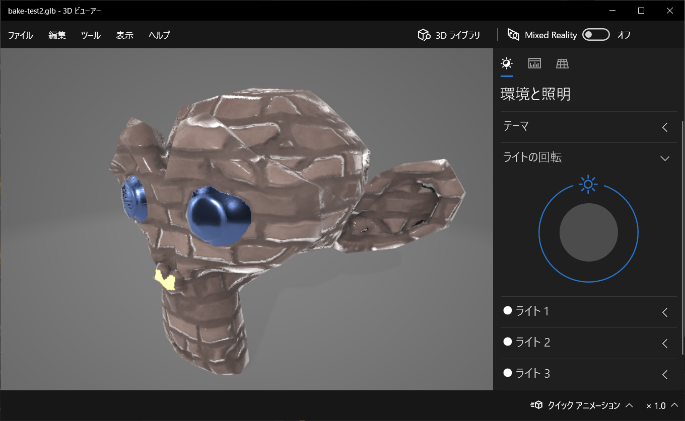

# Blender Texture Batch Bake

ハイポリ複数オブジェクト＆複数マテリアルを、PBR マテリアル用テクスチャ（glTF 出力用ローポリオブジェクト）に一括ベイクするアドオンを作ってみました。

つまりこれがコマンド一発で。


こうなって。


こうなります。（glTF としてエクスポート。Unity とかにそのままインポートできます）



恐らくですが、2.8 以降の Blender に対応しています。

## インストール

[GitHub の本アドオンのページ](https://github.com/genki140/blender-batch-bake)から、ZIP でダウンロードします。


blender を開き、Edit > Preferences から、Add-ons の Install を選択し、ダウンロードした ZIP ファイルをそのまま指定してインストールします。


インストールしたらアドオンのチェックを付けて有効にします。

## 使い方

普通にハイポリ側のオブジェクトを作ります。

複数のオブジェクトでも、複数のマテリアルでも、ミックスシェーダー使っても大丈夫です。

下の画像では、レンガ模様をパターンで生成し、目は青いメタリック、鼻は自分で光るマテリアルにしています。


ローポリ側オブジェクトを作成します。マテリアルは無しの状態にしておきます。

この状態で、マテリアルパネルに「Texture Batch Bake」>「Bake Textures」が表示されていれば、アドオンは正しくインストール出来ています。


通常のベイク時同様、レンダーエンジンを Cycles に変更し、ハイポリローポリベイク時に設定する「Extrusion」「Max Ray Distance」「Margin」を適当な値に設定します。（大体以下ので OK）


ハイポリ側を選んだあとに Ctrl キーを押しながらローポリを選択します。

マテリアルの追加したアドオンのパネルから、「Bake Textures」を実行すると、まずはベイク用のマテリアルが生成されます。


確認する必要はありませんが以下のようになっているため、不要なテクスチャノードはこのタイミングで削除しておくと、不要なテクスチャを生成する時間を短縮できます。

ちなみにこのノード構成は、ベイクした後の glTF でのエクスポート時に有効な構成になっています。[Blender の glTF の説明](https://docs.blender.org/manual/ja/dev/addons/import_export/scene_gltf2.html)を参考にしました。


変更の必要が無ければ、そのまま再び「Bake Textures」を実行すると、一括ベイクが実行されます。（念のため保存してから実行することをお勧めします。）

完了するとこうなります。テクスチャは glTF 出力時に全部変換して含めることが出来るので、blend ファイル内にパック保存しています。


## glTF 出力

glTF は、テクスチャやマテリアルやアニメーションを一つのファイルにまとめて入れられる便利なフォーマットです。

バイナリでまとめて入れるフォーマットは、拡張子が glb となります。

完成したローポリオブジェクトを選択し、glb のエクスポート画面を開きます。


ザックリとこんな感じに設定してエクスポートします。「Tangents」はデフォルトではズレてますが、ノーマルマップ系を綺麗に出力させたければ ON にします。


出来上がった glb ファイルは、Windows10 くらいならダブルクリックでたぶん開きます。


## Unity にインポートする

おまけで glb ファイルを Unity にドラッグ＆ドロップで取り込めるようになる便利なパッケージ[UniVRM](https://github.com/vrm-c/UniVRM)を紹介します。

個人的にアセットを使うとプロジェクトが大きくなって GitHub で使い辛くなるから嫌なので、PackageManager を使います。

PackageManager 左上の＋ボタンから、「Add package from git URL」を選択し、以下の 3 つのパッケージを順番にインストールします。（「Add」を押してからインストールが走るまでちょっと時間がかかるので、焦らず待ちます）

```
https://github.com/vrm-c/UniVRM.git?path=/Assets/MeshUtility#v0.62.0
https://github.com/vrm-c/UniVRM.git?path=/Assets/VRMShaders#v0.62.0
https://github.com/vrm-c/UniVRM.git?path=/Assets/VRM#v0.62.0
```

追加されていることを確認します。


glb ファイルを Assets フォルダにドラッグドロップすると自動でプレハブが作られるので、ヒエラルキーに追加して表示します。ちょっと違うのはライティングの違いかと。


## 今後の予定

テクスチャ解像度をアドオンのパネルから設定できるようにする。

「Extrusion」「Max Ray Distance」「Margin」をアドオンのパネルから設定できるようにする。

レンダーエンジンは設定不要とする。

マテリアルが無い状態からベイクする部分を選んで一発出力できるようにする。

